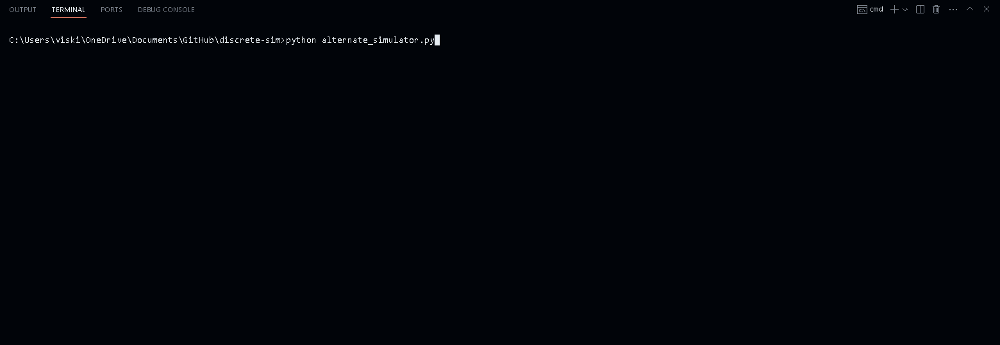

# Discrete Simulation Project

    <a href="https://vikiru.github.io/discrete-sim/setup/">Setup</a>
    •
    <a href="https://vikiru.github.io/discrete-sim/input_modeling/">Code</a>
    •
    <a href="https://vikiru.github.io/discrete-sim/usage/">Usage</a>
     
      
    </img>

## 📝 Project Description

<blockquote align="justify">
The manufacturing facility produces different products (P1, P2, P3) using different combinations of raw components (C1, C2, C3). The components are cleaned and repaired by two inspectors before being sent to workstations (W1, W2, W3) that have buffers for storing them. The inspectors may get blocked if the buffers are full. The workstations start assembling products when they have all the required components. Inspector 1 sends component C1 to the workstation with the shortest queue, while Inspector 2 sends components C2 and C3 randomly. To produce the three products, the following combinations of components are used: P1 is made from C1, P2 is made from C1 and C2, and P3 is made from C1 and C3.
</blockquote>

This repository showcases my term project for SYSC4005, in which I developed a discrete simulation model of a manufacturing facility based on the given problem statement. The purpose of this simulation study was to identify and evaluate an alternative operating policy that could enhance the system performance.

## 👥 Project Author

This project was completed individually by Visakan Kirubakaran.
